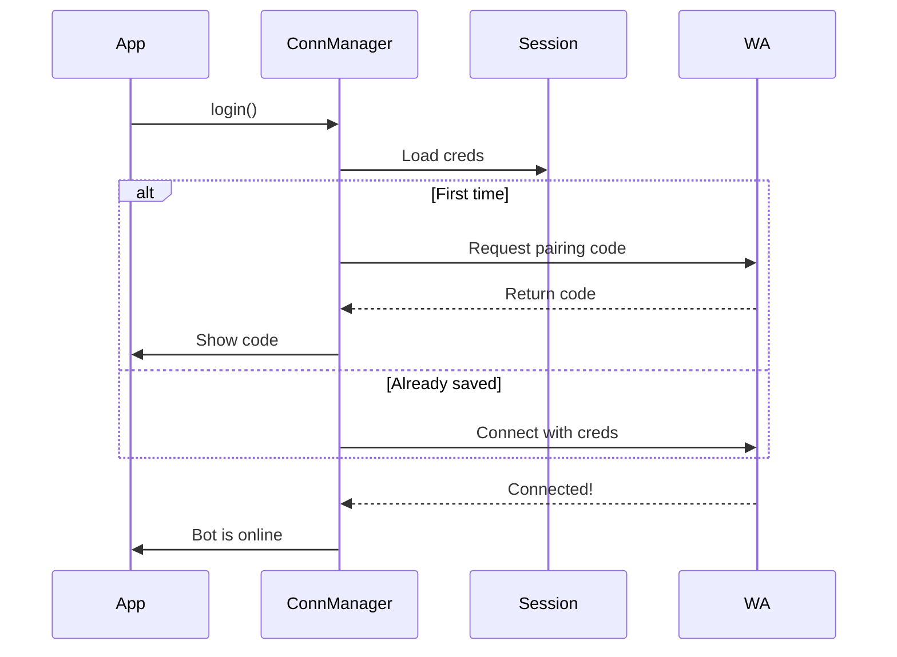

# 🚀 WhatsApp Bot – Connection Manager

Selamat datang kembali!  
Pada [Chapter 1](01_bot_setup___module_exports_.md), kita membahas blueprint `sistem-bot`. Sekarang mari fokus ke inti utamanya: **bagaimana bot login & tetap terhubung ke WhatsApp.**

---

## 🔑 Kenapa Ini Penting?

Bot harus bisa:  
1. **Login ke WhatsApp** (QR atau pairing code)  
2. **Tetap Online** meski internet tidak stabil  
3. **Reconnect Otomatis** kalau terputus  
4. **Dengar Event WhatsApp** (pesan baru, join/leave group, dll)  

Tanpa ini, bot hanyalah kode yang tidak bisa ngobrol dengan siapa pun.  

---

## 🧩 Konsep Utama

- **Session** → status login yang disimpan (biar nggak scan QR tiap restart).  
- **Connection Status** → `online`, `connecting`, atau `offline`.  
- **Auto Reconnect** → kalau koneksi putus, bot coba nyambung lagi.  
- **Events Listener** → tangkap event seperti `messages.upsert`, `connection.update`, dll.  

---

## ⚡ Cara Menyalakan Bot

Minimal setup (`start_bot.js`):

```js
const sistemBot = require('@kelvdra/rapthalia-js');

const botManager = new sistemBot.Baileys({
  name: "my-sistem-bot",
  pairing_code: true,
});

botManager.login()
  .then(() => console.log("✅ Bot login initiated!"))
  .catch((err) => console.error("❌ Failed to login:", err));
```

📌 Output saat dijalankan:

```
⏳ Connecting...
ex: 628xxx...
Enter your number: 6281234567890
✅ Your pairing code: 1234-5678-9012-3456
✅ Bot connected.
```

---

## 🔍 Apa yang Terjadi di Balik Layar?

Flow sederhana koneksi bot:  



---

## 🛠 Core Class: `BaileysBot`

File utama: `system/baileys.js`

```js
class BaileysBot extends EventEmitter {
  constructor(config) {
    super();
    this.config = config;
    this.sessionsName = config.sessions_name || "sessions";
    this.pairing = config.pairing_code || false;
  }

  async login() {
    await this.init();
  }
}
```

Fitur utama:  
- **`useMultiFileAuthState`** → simpan session otomatis  
- **`connection.update`** → deteksi online/offline & auto reconnect  
- **`messages.upsert`** → terima pesan baru lalu emit `msg.notify`  

---

## ✅ Kesimpulan

- Bot punya **lifeline** lewat `BaileysBot`  
- Session disimpan, koneksi stabil, event ditangani otomatis  
- Dengan `login()`, bot siap online & interaktif  

👉 Next: [Extended WhatsApp Client](03_extended_whatsapp_client_.md)  

---
## 🤝 Stay Connected

- 📡 Channel: [Join Kelvdra System](https://whatsapp.com/channel/0029VadrgqYKbYMHyMERXt0e)  
- 📞 Contact: [WhatsApp Admin](https://wa.me/6285173328399)
---

## 🧑‍💻 Author & License

**Kelvdra**  
📜 License: [MIT](./LICENSE)

---

<p align="center">
  <em>Powered by <strong>Kelvdra System</strong> • Fast ⚡ Simple ⚙️ Efficient 🧠</em>
</p>
